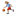
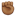
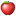
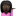
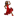
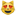
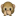
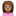
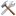

: copyright  
: registered  
: bangbang  
: interrobang  
: tm  
: information_source  
: left_right_arrow  
: arrow_up_down  
: arrow_upper_left  
: arrow_upper_right  
: arrow_lower_right  
: arrow_lower_left  
: leftwards_arrow_with_hook  
: arrow_right_hook  
: watch  
: hourglass  
: keyboard  
: eject  
: fast_forward  
: rewind  
: arrow_double_up  
: arrow_double_down  
: black_right_pointing_double_triangle_with_vertical_bar  
: black_left_pointing_double_triangle_with_vertical_bar  
: black_right_pointing_triangle_with_double_vertical_bar  
: alarm_clock  
: stopwatch  
: timer_clock  
: hourglass_flowing_sand  
: double_vertical_bar  
: black_square_for_stop  
: black_circle_for_record  
: m  
: black_small_square  
: white_small_square  
: arrow_forward  
: arrow_backward  
: white_medium_square  
: black_medium_square  
: white_medium_small_square  
: black_medium_small_square  
: sunny  
: cloud  
: umbrella  
: snowman  
: comet  
: phone  
: telephone  
: ballot_box_with_check  
: umbrella_with_rain_drops  
: coffee  
: shamrock  
: point_up  
: point_up-skin-tone-4  
: point_up-skin-tone-5  
: point_up-skin-tone-6  
: point_up-skin-tone-2  
: point_up-skin-tone-3  
: skull_and_crossbones  
: radioactive_sign  
: biohazard_sign  
: orthodox_cross  
: star_and_crescent  
: peace_symbol  
: yin_yang  
: wheel_of_dharma  
: white_frowning_face  
: relaxed  
: aries  
: taurus  
: gemini  
: cancer  
: leo  
: virgo  
: libra  
: scorpius  
: sagittarius  
: capricorn  
: aquarius  
: pisces  
: spades  
: clubs  
: hearts  
: diamonds  
: hotsprings  
: recycle  
: wheelchair  
: hammer_and_pick  
: anchor  
: crossed_swords  
: scales  
: alembic  
: gear  
: atom_symbol  
: fleur_de_lis  
: warning  
: zap  
: white_circle  
: black_circle  
: coffin  
: funeral_urn  
: soccer  
: baseball  
: snowman_without_snow  
: partly_sunny  
: thunder_cloud_and_rain  
: ophiuchus  
: pick  
: helmet_with_white_cross  
: chains  
: no_entry  
: shinto_shrine  
: church  
: mountain  
: umbrella_on_ground  
: fountain  
: golf  
: ferry  
: boat  
: sailboat  
: skier  
: ice_skate  
: person_with_ball  
: person_with_ball-skin-tone-2  
: person_with_ball-skin-tone-3  
: person_with_ball-skin-tone-4  
: person_with_ball-skin-tone-5  
: person_with_ball-skin-tone-6  
: tent  
: fuelpump  
: scissors  
: white_check_mark  
: airplane  
: email  
: envelope  
: fist  
: fist-skin-tone-3  
: fist-skin-tone-2  
: fist-skin-tone-6  
: fist-skin-tone-5  
: fist-skin-tone-4  
: hand  
: raised_hand  
: hand-skin-tone-2  
: raised_hand-skin-tone-2  
: hand-skin-tone-3  
: raised_hand-skin-tone-3  
: hand-skin-tone-4  
: raised_hand-skin-tone-4  
: hand-skin-tone-5  
: raised_hand-skin-tone-5  
: hand-skin-tone-6  
: raised_hand-skin-tone-6  
: v  
: v-skin-tone-5  
: v-skin-tone-4  
: v-skin-tone-6  
: v-skin-tone-3  
: v-skin-tone-2  
: writing_hand  
: writing_hand-skin-tone-2  
: writing_hand-skin-tone-3  
: writing_hand-skin-tone-6  
: writing_hand-skin-tone-4  
: writing_hand-skin-tone-5  
: pencil2  
: black_nib  
: heavy_check_mark  
: heavy_multiplication_x  
: latin_cross  
: star_of_david  
: sparkles  
: eight_spoked_asterisk  
: eight_pointed_black_star  
: snowflake  
: sparkle  
: x  
: negative_squared_cross_mark  
: question  
: grey_question  
: grey_exclamation  
: exclamation  
: heavy_exclamation_mark  
: heavy_heart_exclamation_mark_ornament  
: heart  
: heavy_plus_sign  
: heavy_minus_sign  
: heavy_division_sign  
: arrow_right  
: curly_loop  
: loop  
: arrow_heading_up  
: arrow_heading_down  
: arrow_left  
: arrow_up  
: arrow_down  
: black_large_square  
: white_large_square  
: star  
: o  
: wavy_dash  
: part_alternation_mark  
: congratulations  
: secret  
: mahjong  
: black_joker  
: a  
: b  
: o2  
: parking  
: ab  
: cl  
: cool  
: free  
: id  
: new  
: ng  
: ok  
: sos  
: up  
: vs  
: koko  
: sa  
: u7121  
: u6307  
: u7981  
: u7a7a  
: u5408  
: u6e80  
: u6709  
: u6708  
: u7533  
: u5272  
: u55b6  
: ideograph_advantage  
: accept  
: cyclone  
: foggy  
: closed_umbrella  
: night_with_stars  
: sunrise_over_mountains  
: sunrise  
: city_sunset  
: city_sunrise  
: rainbow  
: bridge_at_night  
: ocean  
: volcano  
: milky_way  
: earth_africa  
: earth_americas  
: earth_asia  
: globe_with_meridians  
: new_moon  
: waxing_crescent_moon  
: first_quarter_moon  
: moon  
: waxing_gibbous_moon  
: full_moon  
: waning_gibbous_moon  
: last_quarter_moon  
: waning_crescent_moon  
: crescent_moon  
: new_moon_with_face  
: first_quarter_moon_with_face  
: last_quarter_moon_with_face  
: full_moon_with_face  
: sun_with_face  
: star2  
: stars  
: thermometer  
: mostly_sunny  
: sun_small_cloud  
: barely_sunny  
: sun_behind_cloud  
: partly_sunny_rain  
: sun_behind_rain_cloud  
: rain_cloud  
: snow_cloud  
: lightning  
: lightning_cloud  
: tornado  
: tornado_cloud  
: fog  
: wind_blowing_face  
: hotdog  
: taco  
: burrito  
: chestnut  
: seedling  
: evergreen_tree  
: deciduous_tree  
: palm_tree  
: cactus  
: hot_pepper  
: tulip  
: cherry_blossom  
: rose  
: hibiscus  
: sunflower  
: blossom  
: corn  
: ear_of_rice  
: herb  
: four_leaf_clover  
: maple_leaf  
: fallen_leaf  
: leaves  
: mushroom  
: tomato  
: eggplant  
: grapes  
: melon  
: watermelon  
: tangerine  
: lemon  
: banana  
: pineapple  
: apple  
: green_apple  
: pear  
: peach  
: cherries  
: strawberry  
: hamburger  
: pizza  
: meat_on_bone  
: poultry_leg  
: rice_cracker  
: rice_ball  
: rice  
: curry  
: ramen  
: spaghetti  
: bread  
: fries  
: sweet_potato  
: dango  
: oden  
: sushi  
: fried_shrimp  
: fish_cake  
: icecream  
: shaved_ice  
: ice_cream  
: doughnut  
: cookie  
: chocolate_bar  
: candy  
: lollipop  
: custard  
: honey_pot  
: cake  
: bento  
: stew  
: egg  
: fork_and_knife  
: tea  
: sake  
: wine_glass  
: cocktail  
: tropical_drink  
: beer  
: beers  
: baby_bottle  
: knife_fork_plate  
: champagne  
: popcorn  
: ribbon  
: gift  
: birthday  
: jack_o_lantern  
: christmas_tree  
: santa  
: santa-skin-tone-6  
: santa-skin-tone-5  
: santa-skin-tone-4  
: santa-skin-tone-3  
: santa-skin-tone-2  
: fireworks  
: sparkler  
: balloon  
: tada  
: confetti_ball  
: tanabata_tree  
: crossed_flags  
: bamboo  
: dolls  
: flags  
: wind_chime  
: rice_scene  
: school_satchel  
: mortar_board  
: medal  
: reminder_ribbon  
: studio_microphone  
: level_slider  
: control_knobs  
: film_frames  
: admission_tickets  
: carousel_horse  
: ferris_wheel  
: roller_coaster  
: fishing_pole_and_fish  
: microphone  
: movie_camera  
: cinema  
: headphones  
: art  
: tophat  
: circus_tent  
: ticket  
: clapper  
: performing_arts  
: video_game  
: dart  
: slot_machine  
: 8ball  
: game_die  
: bowling  
: flower_playing_cards  
: musical_note  
: notes  
: saxophone  
: guitar  
: musical_keyboard  
: trumpet  
: violin  
: musical_score  
: running_shirt_with_sash  
: tennis  
: ski  
: basketball  
: checkered_flag  
: snowboarder  
: runner  
: running  
: runner-skin-tone-2  
: running-skin-tone-2  
: runner-skin-tone-3  
: running-skin-tone-3  
: runner-skin-tone-4  
: running-skin-tone-4  
: runner-skin-tone-5  
: running-skin-tone-5  
: runner-skin-tone-6  
: running-skin-tone-6  
: surfer  
: surfer-skin-tone-6  
: surfer-skin-tone-5  
: surfer-skin-tone-4  
: surfer-skin-tone-3  
: surfer-skin-tone-2  
: sports_medal  
: trophy  
: horse_racing  
: football  
: rugby_football  
: swimmer  
: swimmer-skin-tone-6  
: swimmer-skin-tone-4  
: swimmer-skin-tone-5  
: swimmer-skin-tone-2  
: swimmer-skin-tone-3  
: weight_lifter  
: weight_lifter-skin-tone-5  
: weight_lifter-skin-tone-4  
: weight_lifter-skin-tone-6  
: weight_lifter-skin-tone-3  
: weight_lifter-skin-tone-2  
: golfer  
: racing_motorcycle  
: racing_car  
: cricket_bat_and_ball  
: volleyball  
: field_hockey_stick_and_ball  
: ice_hockey_stick_and_puck  
: table_tennis_paddle_and_ball  
: snow_capped_mountain  
: camping  
: beach_with_umbrella  
: building_construction  
: house_buildings  
: cityscape  
: derelict_house_building  
: classical_building  
: desert  
: desert_island  
: national_park  
: stadium  
: house  
: house_with_garden  
: office  
: post_office  
: european_post_office  
: hospital  
: bank  
: atm  
: hotel  
: love_hotel  
: convenience_store  
: school  
: department_store  
: factory  
: izakaya_lantern  
: lantern  
: japanese_castle  
: european_castle  
: waving_white_flag  
: waving_black_flag  
: rosette  
: label  
: badminton_racquet_and_shuttlecock  
: bow_and_arrow  
: amphora  
: skin-tone-2  
: skin-tone-3  
: skin-tone-4  
: skin-tone-5  
: skin-tone-6  
: rat  
: mouse2  
: ox  
: water_buffalo  
: cow2  
: tiger2  
: leopard  
: rabbit2  
: cat2  
: dragon  
: crocodile  
: whale2  
: snail  
: snake  
: racehorse  
: ram  
: goat  
: sheep  
: monkey  
: rooster  
: chicken  
: dog2  
: pig2  
: boar  
: elephant  
: octopus  
: shell  
: bug  
: ant  
: bee  
: honeybee  
: beetle  
: fish  
: tropical_fish  
: blowfish  
: turtle  
: hatching_chick  
: baby_chick  
: hatched_chick  
: bird  
: penguin  
: koala  
: poodle  
: dromedary_camel  
: camel  
: dolphin  
: flipper  
: mouse  
: cow  
: tiger  
: rabbit  
: cat  
: dragon_face  
: whale  
: horse  
: monkey_face  
: dog  
: pig  
: frog  
: hamster  
: wolf  
: bear  
: panda_face  
: pig_nose  
: feet  
: paw_prints  
: chipmunk  
: eyes  
: eye  
: ear  
: ear-skin-tone-3  
: ear-skin-tone-2  
: ear-skin-tone-6  
: ear-skin-tone-5  
: ear-skin-tone-4  
: nose  
: nose-skin-tone-6  
: nose-skin-tone-4  
: nose-skin-tone-5  
: nose-skin-tone-2  
: nose-skin-tone-3  
: lips  
: tongue  
: point_up_2  
: point_up_2-skin-tone-6  
: point_up_2-skin-tone-5  
: point_up_2-skin-tone-4  
: point_up_2-skin-tone-3  
: point_up_2-skin-tone-2  
: point_down  
: point_down-skin-tone-2  
: point_down-skin-tone-3  
: point_down-skin-tone-6  
: point_down-skin-tone-4  
: point_down-skin-tone-5  
: point_left  
: point_left-skin-tone-5  
: point_left-skin-tone-4  
: point_left-skin-tone-6  
: point_left-skin-tone-3  
: point_left-skin-tone-2  
: point_right  
: point_right-skin-tone-2  
: point_right-skin-tone-3  
: point_right-skin-tone-4  
: point_right-skin-tone-5  
: point_right-skin-tone-6  
: facepunch  
: punch  
: facepunch-skin-tone-2  
: punch-skin-tone-2  
: facepunch-skin-tone-3  
: punch-skin-tone-3  
: facepunch-skin-tone-4  
: punch-skin-tone-4  
: facepunch-skin-tone-5  
: punch-skin-tone-5  
: facepunch-skin-tone-6  
: punch-skin-tone-6  
: wave  
: wave-skin-tone-3  
: wave-skin-tone-2  
: wave-skin-tone-6  
: wave-skin-tone-5  
: wave-skin-tone-4  
: ok_hand  
: ok_hand-skin-tone-6  
: ok_hand-skin-tone-4  
: ok_hand-skin-tone-5  
: ok_hand-skin-tone-2  
: ok_hand-skin-tone-3  
: +1  
: thumbsup  
: +1-skin-tone-3  
: thumbsup-skin-tone-3  
: +1-skin-tone-2  
: thumbsup-skin-tone-2  
: +1-skin-tone-5  
: thumbsup-skin-tone-5  
: +1-skin-tone-4  
: thumbsup-skin-tone-4  
: +1-skin-tone-6  
: thumbsup-skin-tone-6  
: -1  
: thumbsdown  
: -1-skin-tone-4  
: thumbsdown-skin-tone-4  
: -1-skin-tone-5  
: thumbsdown-skin-tone-5  
: -1-skin-tone-6  
: thumbsdown-skin-tone-6  
: -1-skin-tone-2  
: thumbsdown-skin-tone-2  
: -1-skin-tone-3  
: thumbsdown-skin-tone-3  
: clap  
: clap-skin-tone-6  
: clap-skin-tone-5  
: clap-skin-tone-4  
: clap-skin-tone-3  
: clap-skin-tone-2  
: open_hands  
: open_hands-skin-tone-6  
: open_hands-skin-tone-4  
: open_hands-skin-tone-5  
: open_hands-skin-tone-2  
: open_hands-skin-tone-3  
: crown  
: womans_hat  
: eyeglasses  
: necktie  
: shirt  
: tshirt  
: jeans  
: dress  
: kimono  
: bikini  
: womans_clothes  
: purse  
: handbag  
: pouch  
: mans_shoe  
: shoe  
: athletic_shoe  
: high_heel  
: sandal  
: boot  
: footprints  
: bust_in_silhouette  
: busts_in_silhouette  
: boy  
: boy-skin-tone-3  
: boy-skin-tone-2  
: boy-skin-tone-5  
: boy-skin-tone-4  
: boy-skin-tone-6  
: girl  
: girl-skin-tone-4  
: girl-skin-tone-5  
: girl-skin-tone-6  
: girl-skin-tone-2  
: girl-skin-tone-3  
: man  
: man-skin-tone-3  
: man-skin-tone-2  
: man-skin-tone-6  
: man-skin-tone-5  
: man-skin-tone-4  
: woman  
: woman-skin-tone-6  
: woman-skin-tone-4  
: woman-skin-tone-5  
: woman-skin-tone-2  
: woman-skin-tone-3  
: family  
: man-woman-boy  
: couple  
: man_and_woman_holding_hands  
: two_men_holding_hands  
: two_women_holding_hands  
: cop  
: cop-skin-tone-2  
: cop-skin-tone-3  
: cop-skin-tone-6  
: cop-skin-tone-4  
: cop-skin-tone-5  
: dancers  
: bride_with_veil  
: bride_with_veil-skin-tone-4  
: bride_with_veil-skin-tone-5  
: bride_with_veil-skin-tone-6  
: bride_with_veil-skin-tone-2  
: bride_with_veil-skin-tone-3  
: person_with_blond_hair  
: person_with_blond_hair-skin-tone-3  
: person_with_blond_hair-skin-tone-2  
: person_with_blond_hair-skin-tone-5  
: person_with_blond_hair-skin-tone-4  
: person_with_blond_hair-skin-tone-6  
: man_with_gua_pi_mao  
: man_with_gua_pi_mao-skin-tone-2  
: man_with_gua_pi_mao-skin-tone-3  
: man_with_gua_pi_mao-skin-tone-6  
: man_with_gua_pi_mao-skin-tone-4  
: man_with_gua_pi_mao-skin-tone-5  
: man_with_turban  
: man_with_turban-skin-tone-6  
: man_with_turban-skin-tone-5  
: man_with_turban-skin-tone-4  
: man_with_turban-skin-tone-3  
: man_with_turban-skin-tone-2  
: older_man  
: older_man-skin-tone-2  
: older_man-skin-tone-3  
: older_man-skin-tone-4  
: older_man-skin-tone-5  
: older_man-skin-tone-6  
: older_woman  
: older_woman-skin-tone-5  
: older_woman-skin-tone-4  
: older_woman-skin-tone-6  
: older_woman-skin-tone-3  
: older_woman-skin-tone-2  
: baby  
: baby-skin-tone-6  
: baby-skin-tone-4  
: baby-skin-tone-5  
: baby-skin-tone-2  
: baby-skin-tone-3  
: construction_worker  
: construction_worker-skin-tone-3  
: construction_worker-skin-tone-2  
: construction_worker-skin-tone-6  
: construction_worker-skin-tone-5  
: construction_worker-skin-tone-4  
: princess  
: princess-skin-tone-4  
: princess-skin-tone-5  
: princess-skin-tone-6  
: princess-skin-tone-2  
: princess-skin-tone-3  
: japanese_ogre  
: japanese_goblin  
: ghost  
: angel  
: angel-skin-tone-6  
: angel-skin-tone-5  
: angel-skin-tone-4  
: angel-skin-tone-3  
: angel-skin-tone-2  
: alien  
: space_invader  
: imp  
: skull  
: information_desk_person  
: information_desk_person-skin-tone-4  
: information_desk_person-skin-tone-5  
: information_desk_person-skin-tone-6  
: information_desk_person-skin-tone-2  
: information_desk_person-skin-tone-3  
: guardsman  
: guardsman-skin-tone-6  
: guardsman-skin-tone-5  
: guardsman-skin-tone-4  
: guardsman-skin-tone-3  
: guardsman-skin-tone-2  
: dancer  
: dancer-skin-tone-2  
: dancer-skin-tone-3  
: dancer-skin-tone-6  
: dancer-skin-tone-4  
: dancer-skin-tone-5  
: lipstick  
: nail_care  
: nail_care-skin-tone-2  
: nail_care-skin-tone-3  
: nail_care-skin-tone-4  
: nail_care-skin-tone-5  
: nail_care-skin-tone-6  
: massage  
: massage-skin-tone-3  
: massage-skin-tone-2  
: massage-skin-tone-6  
: massage-skin-tone-5  
: massage-skin-tone-4  
: haircut  
: haircut-skin-tone-6  
: haircut-skin-tone-4  
: haircut-skin-tone-5  
: haircut-skin-tone-2  
: haircut-skin-tone-3  
: barber  
: syringe  
: pill  
: kiss  
: love_letter  
: ring  
: gem  
: couplekiss  
: bouquet  
: couple_with_heart  
: wedding  
: heartbeat  
: broken_heart  
: two_hearts  
: sparkling_heart  
: heartpulse  
: cupid  
: blue_heart  
: green_heart  
: yellow_heart  
: purple_heart  
: gift_heart  
: revolving_hearts  
: heart_decoration  
: diamond_shape_with_a_dot_inside  
: bulb  
: anger  
: bomb  
: zzz  
: boom  
: collision  
: sweat_drops  
: droplet  
: dash  
: hankey  
: poop  
: shit  
: muscle  
: muscle-skin-tone-6  
: muscle-skin-tone-5  
: muscle-skin-tone-4  
: muscle-skin-tone-3  
: muscle-skin-tone-2  
: dizzy  
: speech_balloon  
: thought_balloon  
: white_flower  
: 100  
: moneybag  
: currency_exchange  
: heavy_dollar_sign  
: credit_card  
: yen  
: dollar  
: euro  
: pound  
: money_with_wings  
: chart  
: seat  
: computer  
: briefcase  
: minidisc  
: floppy_disk  
: cd  
: dvd  
: file_folder  
: open_file_folder  
: page_with_curl  
: page_facing_up  
: date  
: calendar  
: card_index  
: chart_with_upwards_trend  
: chart_with_downwards_trend  
: bar_chart  
: clipboard  
: pushpin  
: round_pushpin  
: paperclip  
: straight_ruler  
: triangular_ruler  
: bookmark_tabs  
: ledger  
: notebook  
: notebook_with_decorative_cover  
: closed_book  
: book  
: open_book  
: green_book  
: blue_book  
: orange_book  
: books  
: name_badge  
: scroll  
: memo  
: pencil  
: telephone_receiver  
: pager  
: fax  
: satellite_antenna  
: loudspeaker  
: mega  
: outbox_tray  
: inbox_tray  
: package  
: e-mail  
: incoming_envelope  
: envelope_with_arrow  
: mailbox_closed  
: mailbox  
: mailbox_with_mail  
: mailbox_with_no_mail  
: postbox  
: postal_horn  
: newspaper  
: iphone  
: calling  
: vibration_mode  
: mobile_phone_off  
: no_mobile_phones  
: signal_strength  
: camera  
: camera_with_flash  
: video_camera  
: tv  
: radio  
: vhs  
: film_projector  
: prayer_beads  
: twisted_rightwards_arrows  
: repeat  
: repeat_one  
: arrows_clockwise  
: arrows_counterclockwise  
: low_brightness  
: high_brightness  
: mute  
: speaker  
: sound  
: loud_sound  
: battery  
: electric_plug  
: mag  
: mag_right  
: lock_with_ink_pen  
: closed_lock_with_key  
: key  
: lock  
: unlock  
: bell  
: no_bell  
: bookmark  
: link  
: radio_button  
: back  
: end  
: on  
: soon  
: top  
: underage  
: keycap_ten  
: capital_abcd  
: abcd  
: 1234  
: symbols  
: abc  
: fire  
: flashlight  
: wrench  
: hammer  
: nut_and_bolt  
: hocho  
: knife  
: gun  
: microscope  
: telescope  
: crystal_ball  
: six_pointed_star  
: beginner  
: trident  
: black_square_button  
: white_square_button  
: red_circle  
: large_blue_circle  
: large_orange_diamond  
: large_blue_diamond  
: small_orange_diamond  
: small_blue_diamond  
: small_red_triangle  
: small_red_triangle_down  
: arrow_up_small  
: arrow_down_small  
: om_symbol  
: dove_of_peace  
: kaaba  
: mosque  
: synagogue  
: menorah_with_nine_branches  
: clock1  
: clock2  
: clock3  
: clock4  
: clock5  
: clock6  
: clock7  
: clock8  
: clock9  
: clock10  
: clock11  
: clock12  
: clock130  
: clock230  
: clock330  
: clock430  
: clock530  
: clock630  
: clock730  
: clock830  
: clock930  
: clock1030  
: clock1130  
: clock1230  
: candle  
: mantelpiece_clock  
: hole  
: man_in_business_suit_levitating  
: sleuth_or_spy  
: sleuth_or_spy-skin-tone-2  
: sleuth_or_spy-skin-tone-3  
: sleuth_or_spy-skin-tone-4  
: sleuth_or_spy-skin-tone-5  
: sleuth_or_spy-skin-tone-6  
: dark_sunglasses  
: spider  
: spider_web  
: joystick  
: linked_paperclips  
: lower_left_ballpoint_pen  
: lower_left_fountain_pen  
: lower_left_paintbrush  
: lower_left_crayon  
: raised_hand_with_fingers_splayed  
: raised_hand_with_fingers_splayed-skin-tone-3  
: raised_hand_with_fingers_splayed-skin-tone-2  
: raised_hand_with_fingers_splayed-skin-tone-6  
: raised_hand_with_fingers_splayed-skin-tone-5  
: raised_hand_with_fingers_splayed-skin-tone-4  
: middle_finger  
: reversed_hand_with_middle_finger_extended  
: middle_finger-skin-tone-2  
: reversed_hand_with_middle_finger_extended-skin-tone-2  
: middle_finger-skin-tone-3  
: reversed_hand_with_middle_finger_extended-skin-tone-3  
: middle_finger-skin-tone-6  
: reversed_hand_with_middle_finger_extended-skin-tone-6  
: middle_finger-skin-tone-4  
: reversed_hand_with_middle_finger_extended-skin-tone-4  
: middle_finger-skin-tone-5  
: reversed_hand_with_middle_finger_extended-skin-tone-5  
: spock-hand  
: spock-hand-skin-tone-3  
: spock-hand-skin-tone-2  
: spock-hand-skin-tone-5  
: spock-hand-skin-tone-4  
: spock-hand-skin-tone-6  
: desktop_computer  
: printer  
: three_button_mouse  
: trackball  
: frame_with_picture  
: card_index_dividers  
: card_file_box  
: file_cabinet  
: wastebasket  
: spiral_note_pad  
: spiral_calendar_pad  
: compression  
: old_key  
: rolled_up_newspaper  
: dagger_knife  
: speaking_head_in_silhouette  
: left_speech_bubble  
: right_anger_bubble  
: ballot_box_with_ballot  
: world_map  
: mount_fuji  
: tokyo_tower  
: statue_of_liberty  
: japan  
: moyai  
: grinning  
: grin  
: joy  
: smiley  
: smile  
: sweat_smile  
: laughing  
: satisfied  
: innocent  
: smiling_imp  
: wink  
: blush  
: yum  
: relieved  
: heart_eyes  
: sunglasses  
: smirk  
: neutral_face  
: expressionless  
: unamused  
: sweat  
: pensive  
: confused  
: confounded  
: kissing  
: kissing_heart  
: kissing_smiling_eyes  
: kissing_closed_eyes  
: stuck_out_tongue  
: stuck_out_tongue_winking_eye  
: stuck_out_tongue_closed_eyes  
: disappointed  
: worried  
: angry  
: rage  
: cry  
: persevere  
: triumph  
: disappointed_relieved  
: frowning  
: anguished  
: fearful  
: weary  
: sleepy  
: tired_face  
: grimacing  
: sob  
: open_mouth  
: hushed  
: cold_sweat  
: scream  
: astonished  
: flushed  
: sleeping  
: dizzy_face  
: no_mouth  
: mask  
: smile_cat  
: joy_cat  
: smiley_cat  
: heart_eyes_cat  
: smirk_cat  
: kissing_cat  
: pouting_cat  
: crying_cat_face  
: scream_cat  
: slightly_frowning_face  
: slightly_smiling_face  
: upside_down_face  
: face_with_rolling_eyes  
: no_good  
: no_good-skin-tone-2  
: no_good-skin-tone-3  
: no_good-skin-tone-6  
: no_good-skin-tone-4  
: no_good-skin-tone-5  
: ok_woman  
: ok_woman-skin-tone-3  
: ok_woman-skin-tone-2  
: ok_woman-skin-tone-5  
: ok_woman-skin-tone-4  
: ok_woman-skin-tone-6  
: bow  
: bow-skin-tone-4  
: bow-skin-tone-5  
: bow-skin-tone-6  
: bow-skin-tone-2  
: bow-skin-tone-3  
: see_no_evil  
: hear_no_evil  
: speak_no_evil  
: raising_hand  
: raising_hand-skin-tone-5  
: raising_hand-skin-tone-4  
: raising_hand-skin-tone-6  
: raising_hand-skin-tone-3  
: raising_hand-skin-tone-2  
: raised_hands  
: raised_hands-skin-tone-2  
: raised_hands-skin-tone-3  
: raised_hands-skin-tone-4  
: raised_hands-skin-tone-5  
: raised_hands-skin-tone-6  
: person_frowning  
: person_frowning-skin-tone-6  
: person_frowning-skin-tone-5  
: person_frowning-skin-tone-4  
: person_frowning-skin-tone-3  
: person_frowning-skin-tone-2  
: person_with_pouting_face  
: person_with_pouting_face-skin-tone-2  
: person_with_pouting_face-skin-tone-3  
: person_with_pouting_face-skin-tone-6  
: person_with_pouting_face-skin-tone-4  
: person_with_pouting_face-skin-tone-5  
: pray  
: pray-skin-tone-3  
: pray-skin-tone-2  
: pray-skin-tone-5  
: pray-skin-tone-4  
: pray-skin-tone-6  
: rocket  
: helicopter  
: steam_locomotive  
: railway_car  
: bullettrain_side  
: bullettrain_front  
: train2  
: metro  
: light_rail  
: station  
: tram  
: train  
: bus  
: oncoming_bus  
: trolleybus  
: busstop  
: minibus  
: ambulance  
: fire_engine  
: police_car  
: oncoming_police_car  
: taxi  
: oncoming_taxi  
: car  
: red_car  
: oncoming_automobile  
: blue_car  
: truck  
: articulated_lorry  
: tractor  
: monorail  
: mountain_railway  
: suspension_railway  
: mountain_cableway  
: aerial_tramway  
: ship  
: rowboat  
: rowboat-skin-tone-3  
: rowboat-skin-tone-2  
: rowboat-skin-tone-6  
: rowboat-skin-tone-5  
: rowboat-skin-tone-4  
: speedboat  
: traffic_light  
: vertical_traffic_light  
: construction  
: rotating_light  
: triangular_flag_on_post  
: door  
: no_entry_sign  
: smoking  
: no_smoking  
: put_litter_in_its_place  
: do_not_litter  
: potable_water  
: non-potable_water  
: bike  
: no_bicycles  
: bicyclist  
: bicyclist-skin-tone-5  
: bicyclist-skin-tone-4  
: bicyclist-skin-tone-6  
: bicyclist-skin-tone-3  
: bicyclist-skin-tone-2  
: mountain_bicyclist  
: mountain_bicyclist-skin-tone-2  
: mountain_bicyclist-skin-tone-3  
: mountain_bicyclist-skin-tone-4  
: mountain_bicyclist-skin-tone-5  
: mountain_bicyclist-skin-tone-6  
: walking  
: walking-skin-tone-3  
: walking-skin-tone-2  
: walking-skin-tone-6  
: walking-skin-tone-5  
: walking-skin-tone-4  
: no_pedestrians  
: children_crossing  
: mens  
: womens  
: restroom  
: baby_symbol  
: toilet  
: wc  
: shower  
: bath  
: bath-skin-tone-2  
: bath-skin-tone-3  
: bath-skin-tone-6  
: bath-skin-tone-4  
: bath-skin-tone-5  
: bathtub  
: passport_control  
: customs  
: baggage_claim  
: left_luggage  
: couch_and_lamp  
: sleeping_accommodation  
: shopping_bags  
: bellhop_bell  
: bed  
: place_of_worship  
: hammer_and_wrench  
: shield  
: oil_drum  
: motorway  
: railway_track  
: motor_boat  
: small_airplane  
: airplane_departure  
: airplane_arriving  
: satellite  
: passenger_ship  
: zipper_mouth_face  
: money_mouth_face  
: face_with_thermometer  
: nerd_face  
: thinking_face  
: face_with_head_bandage  
: robot_face  
: hugging_face  
: the_horns  
: sign_of_the_horns  
: the_horns-skin-tone-6  
: sign_of_the_horns-skin-tone-6  
: the_horns-skin-tone-5  
: sign_of_the_horns-skin-tone-5  
: the_horns-skin-tone-4  
: sign_of_the_horns-skin-tone-4  
: the_horns-skin-tone-3  
: sign_of_the_horns-skin-tone-3  
: the_horns-skin-tone-2  
: sign_of_the_horns-skin-tone-2  
: crab  
: lion_face  
: scorpion  
: turkey  
: unicorn_face  
: cheese_wedge  
: hash  
: keycap_star  
: zero  
: one  
: two  
: three  
: four  
: five  
: six  
: seven  
: eight  
: nine  
: flag-ac  
: flag-ad  
: flag-ae  
: flag-af  
: flag-ag  
: flag-ai  
: flag-al  
: flag-am  
: flag-ao  
: flag-aq  
: flag-ar  
: flag-as  
: flag-at  
: flag-au  
: flag-aw  
: flag-ax  
: flag-az  
: flag-ba  
: flag-bb  
: flag-bd  
: flag-be  
: flag-bf  
: flag-bg  
: flag-bh  
: flag-bi  
: flag-bj  
: flag-bl  
: flag-bm  
: flag-bn  
: flag-bo  
: flag-bq  
: flag-br  
: flag-bs  
: flag-bt  
: flag-bv  
: flag-bw  
: flag-by  
: flag-bz  
: flag-ca  
: flag-cc  
: flag-cd  
: flag-cf  
: flag-cg  
: flag-ch  
: flag-ci  
: flag-ck  
: flag-cl  
: flag-cm  
: flag-cn  
: cn  
: flag-co  
: flag-cp  
: flag-cr  
: flag-cu  
: flag-cv  
: flag-cw  
: flag-cx  
: flag-cy  
: flag-cz  
: flag-de  
: de  
: flag-dg  
: flag-dj  
: flag-dk  
: flag-dm  
: flag-do  
: flag-dz  
: flag-ea  
: flag-ec  
: flag-ee  
: flag-eg  
: flag-eh  
: flag-er  
: flag-es  
: es  
: flag-et  
: flag-eu  
: flag-fi  
: flag-fj  
: flag-fk  
: flag-fm  
: flag-fo  
: flag-fr  
: fr  
: flag-ga  
: flag-gb  
: gb  
: uk  
: flag-gd  
: flag-ge  
: flag-gf  
: flag-gg  
: flag-gh  
: flag-gi  
: flag-gl  
: flag-gm  
: flag-gn  
: flag-gp  
: flag-gq  
: flag-gr  
: flag-gs  
: flag-gt  
: flag-gu  
: flag-gw  
: flag-gy  
: flag-hk  
: flag-hm  
: flag-hn  
: flag-hr  
: flag-ht  
: flag-hu  
: flag-ic  
: flag-id  
: flag-ie  
: flag-il  
: flag-im  
: flag-in  
: flag-io  
: flag-iq  
: flag-ir  
: flag-is  
: flag-it  
: it  
: flag-je  
: flag-jm  
: flag-jo  
: flag-jp  
: jp  
: flag-ke  
: flag-kg  
: flag-kh  
: flag-ki  
: flag-km  
: flag-kn  
: flag-kp  
: flag-kr  
: kr  
: flag-kw  
: flag-ky  
: flag-kz  
: flag-la  
: flag-lb  
: flag-lc  
: flag-li  
: flag-lk  
: flag-lr  
: flag-ls  
: flag-lt  
: flag-lu  
: flag-lv  
: flag-ly  
: flag-ma  
: flag-mc  
: flag-md  
: flag-me  
: flag-mf  
: flag-mg  
: flag-mh  
: flag-mk  
: flag-ml  
: flag-mm  
: flag-mn  
: flag-mo  
: flag-mp  
: flag-mq  
: flag-mr  
: flag-ms  
: flag-mt  
: flag-mu  
: flag-mv  
: flag-mw  
: flag-mx  
: flag-my  
: flag-mz  
: flag-na  
: flag-nc  
: flag-ne  
: flag-nf  
: flag-ng  
: flag-ni  
: flag-nl  
: flag-no  
: flag-np  
: flag-nr  
: flag-nu  
: flag-nz  
: flag-om  
: flag-pa  
: flag-pe  
: flag-pf  
: flag-pg  
: flag-ph  
: flag-pk  
: flag-pl  
: flag-pm  
: flag-pn  
: flag-pr  
: flag-ps  
: flag-pt  
: flag-pw  
: flag-py  
: flag-qa  
: flag-re  
: flag-ro  
: flag-rs  
: flag-ru  
: ru  
: flag-rw  
: flag-sa  
: flag-sb  
: flag-sc  
: flag-sd  
: flag-se  
: flag-sg  
: flag-sh  
: flag-si  
: flag-sj  
: flag-sk  
: flag-sl  
: flag-sm  
: flag-sn  
: flag-so  
: flag-sr  
: flag-ss  
: flag-st  
: flag-sv  
: flag-sx  
: flag-sy  
: flag-sz  
: flag-ta  
: flag-tc  
: flag-td  
: flag-tf  
: flag-tg  
: flag-th  
: flag-tj  
: flag-tk  
: flag-tl  
: flag-tm  
: flag-tn  
: flag-to  
: flag-tr  
: flag-tt  
: flag-tv  
: flag-tw  
: flag-tz  
: flag-ua  
: flag-ug  
: flag-um  
: flag-us  
: us  
: flag-uy  
: flag-uz  
: flag-va  
: flag-vc  
: flag-ve  
: flag-vg  
: flag-vi  
: flag-vn  
: flag-vu  
: flag-wf  
: flag-ws  
: flag-xk  
: flag-ye  
: flag-yt  
: flag-za  
: flag-zm  
: flag-zw  
: man-man-boy  
: man-man-boy-boy  
: man-man-girl  
: man-man-girl-boy  
: man-man-girl-girl  
: man-woman-boy-boy  
: man-woman-girl  
: man-woman-girl-boy  
: man-woman-girl-girl  
: man-heart-man  
: man-kiss-man  
: woman-woman-boy  
: woman-woman-boy-boy  
: woman-woman-girl  
: woman-woman-girl-boy  
: woman-woman-girl-girl  
: woman-heart-woman  
: woman-kiss-woman  
: simple_smile  
: eye_left_speechbubble  
